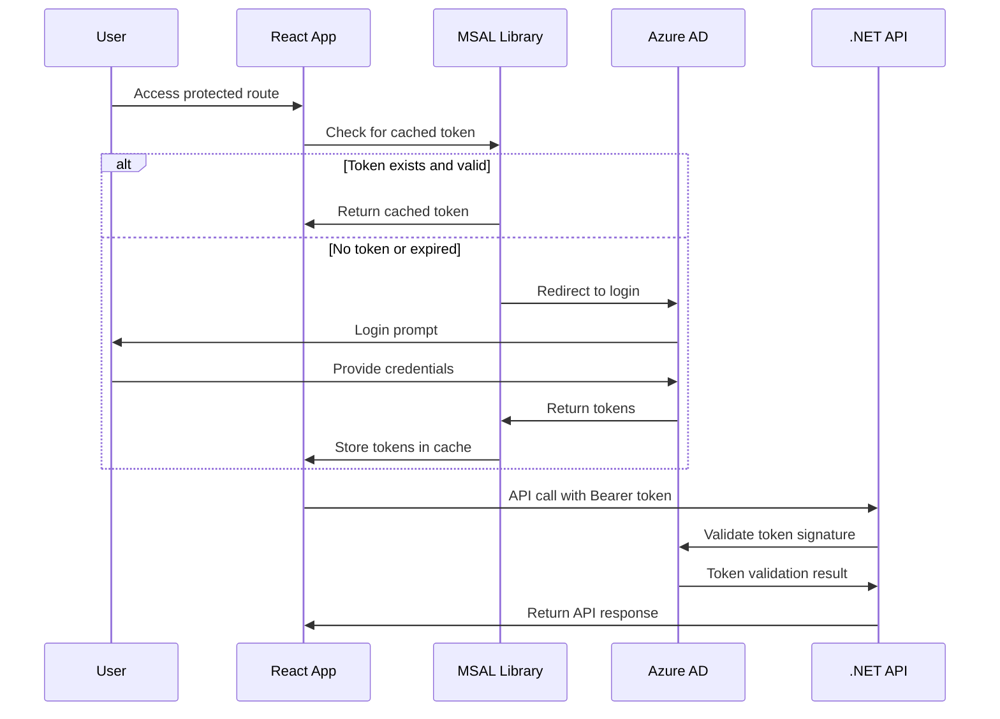

# MSAL Authentication Implementation Guide

This document provides a complete guide for implementing Microsoft Authentication Library (MSAL) authentication in a React + .NET application, based on the implementation in the Anela Heblo project.

## Table of Contents

1. [Architecture Overview](#architecture-overview)
2. [Azure AD App Registrations](#azure-ad-app-registrations)
3. [Frontend Implementation (React + MSAL)](#frontend-implementation-react--msal)
4. [Backend Implementation (.NET + Microsoft Identity)](#backend-implementation-net--microsoft-identity)
5. [Configuration & Environment Variables](#configuration--environment-variables)
6. [Authentication Modes](#authentication-modes)
7. [Token Management](#token-management)
8. [API Integration](#api-integration)
9. [Security Considerations](#security-considerations)
10. [Troubleshooting](#troubleshooting)

## Architecture Overview

The authentication system supports three modes:
- **Production**: Full MSAL authentication with Microsoft Entra ID
- **Development**: Mock authentication for local development
- **E2E Testing**: Service principal authentication for automated testing

### Authentication Flow



## Azure AD App Registrations

### Frontend App Registration (Single Page Application)

Create a new app registration in Azure AD with these settings:

**Basic Configuration:**
- **Application Type**: Single Page Application (SPA)
- **Name**: `YourApp-Frontend`
- **Supported Account Types**: Accounts in this organizational directory only

**Redirect URIs:**
```
http://localhost:3000/
https://yourdomain.com/
https://staging.yourdomain.com/
```

**API Permissions:**
- Microsoft Graph:
  - `User.Read` (Delegated)
  - `openid` (Delegated)
  - `profile` (Delegated)
- Your Backend API:
  - `api://[backend-client-id]/access_as_user` (Delegated)

**Advanced Settings:**
- **Allow public client flows**: No
- **Enable ID tokens**: Yes
- **Enable access tokens**: Yes

### Backend App Registration (Web API)

Create a second app registration for the backend:

**Basic Configuration:**
- **Application Type**: Web API
- **Name**: `YourApp-Backend`
- **Supported Account Types**: Accounts in this organizational directory only

**Expose an API:**
```json
{
  "Application ID URI": "api://[client-id]",
  "Scopes": [
    {
      "Scope name": "access_as_user",
      "Admin consent display name": "Access API as user",
      "Admin consent description": "Allow the app to access the API on behalf of the signed-in user",
      "User consent display name": "Access the application on your behalf",
      "User consent description": "Allow the app to access the application on your behalf",
      "State": "Enabled"
    }
  ]
}
```

**App Roles (Optional):**
```json
[
  {
    "displayName": "Finance Reader",
    "value": "finance_reader",
    "description": "Can read financial data",
    "allowedMemberTypes": ["User"],
    "isEnabled": true
  },
  {
    "displayName": "Admin",
    "value": "admin", 
    "description": "Full administrative access",
    "allowedMemberTypes": ["User"],
    "isEnabled": true
  }
]
```

**Client Secret:**
- Generate a client secret for the backend app
- Store securely in Azure Key Vault or app configuration

## Frontend Implementation (React + MSAL)

### 1. Install Dependencies

```bash
npm install @azure/msal-browser @azure/msal-react
```

### 2. MSAL Configuration

Create `/src/auth/msalConfig.ts`:

```typescript
import { Configuration, PopupRequest } from '@azure/msal-browser';

export const msalConfig: Configuration = {
  auth: {
    clientId: process.env.REACT_APP_AZURE_CLIENT_ID!,
    authority: process.env.REACT_APP_AZURE_AUTHORITY!,
    redirectUri: window.location.origin,
    postLogoutRedirectUri: window.location.origin,
    clientCapabilities: ["CP1"], // Support for claims challenges
  },
  cache: {
    cacheLocation: "sessionStorage", // More secure than localStorage
    storeAuthStateInCookie: false,
  },
  system: {
    allowNativeBroker: false, // Disable WAM Broker for web apps
  },
};

// Request configuration for API access
export const apiRequest: PopupRequest = {
  scopes: [`api://${process.env.REACT_APP_AZURE_BACKEND_CLIENT_ID}/.default`],
  prompt: "consent",
};

// Request configuration for user info
export const userRequest: PopupRequest = {
  scopes: ["User.Read", "openid", "profile"],
};
```

### 3. Authentication Hook

Create `/src/auth/useAuth.ts`:

```typescript
import { useCallback, useEffect, useState } from 'react';
import { useMsal } from '@azure/msal-react';
import { AccountInfo, InteractionRequiredAuthError } from '@azure/msal-browser';
import { apiRequest } from './msalConfig';

interface AuthContextType {
  user: AccountInfo | null;
  isAuthenticated: boolean;
  login: () => Promise<void>;
  logout: () => Promise<void>;
  getAccessToken: () => Promise<string | null>;
  isLoading: boolean;
}

// Token cache with expiration
interface TokenCache {
  token: string;
  expiresAt: number;
}

let tokenCache: TokenCache | null = null;

export const useAuth = (): AuthContextType => {
  const { instance, accounts, inProgress } = useMsal();
  const [isLoading, setIsLoading] = useState(false);
  
  const account = accounts[0] || null;
  const isAuthenticated = !!account;

  // Login function with popup flow
  const login = useCallback(async () => {
    setIsLoading(true);
    try {
      await instance.loginPopup(apiRequest);
    } catch (error) {
      console.error('Login failed:', error);
      throw error;
    } finally {
      setIsLoading(false);
    }
  }, [instance]);

  // Logout function
  const logout = useCallback(async () => {
    setIsLoading(true);
    try {
      tokenCache = null; // Clear token cache
      await instance.logoutPopup();
    } catch (error) {
      console.error('Logout failed:', error);
      throw error;
    } finally {
      setIsLoading(false);
    }
  }, [instance]);

  // Token acquisition with caching
  const getAccessToken = useCallback(async (): Promise<string | null> => {
    if (!account) return null;

    // Check cached token
    if (tokenCache && Date.now() < tokenCache.expiresAt) {
      return tokenCache.token;
    }

    try {
      // Try silent token acquisition
      const response = await instance.acquireTokenSilent({
        ...apiRequest,
        account,
      });
      
      // Cache token for 55 minutes (5-minute buffer before expiration)
      tokenCache = {
        token: response.accessToken,
        expiresAt: Date.now() + 55 * 60 * 1000
      };
      
      return response.accessToken;
    } catch (error) {
      if (error instanceof InteractionRequiredAuthError) {
        // Fallback to popup for interactive token acquisition
        try {
          const response = await instance.acquireTokenPopup({
            ...apiRequest,
            account,
          });
          
          tokenCache = {
            token: response.accessToken,
            expiresAt: Date.now() + 55 * 60 * 1000
          };
          
          return response.accessToken;
        } catch (popupError) {
          console.error('Token acquisition failed:', popupError);
          return null;
        }
      }
      
      console.error('Token acquisition failed:', error);
      return null;
    }
  }, [instance, account]);

  return {
    user: account,
    isAuthenticated,
    login,
    logout,
    getAccessToken,
    isLoading: isLoading || inProgress !== 'none',
  };
};
```

### 4. Authentication Provider Setup

Update your `App.tsx`:

```typescript
import { MsalProvider } from '@azure/msal-react';
import { PublicClientApplication } from '@azure/msal-browser';
import { msalConfig } from './auth/msalConfig';
import { AuthGuard } from './components/auth/AuthGuard';

// Create MSAL instance
const msalInstance = new PublicClientApplication(msalConfig);

function App() {
  return (
    <MsalProvider instance={msalInstance}>
      <AuthGuard>
        {/* Your app components */}
      </AuthGuard>
    </MsalProvider>
  );
}

export default App;
```

### 5. Auth Guard Component

Create `/src/components/auth/AuthGuard.tsx`:

```typescript
import React, { useEffect } from 'react';
import { useAuth } from '../../auth/useAuth';
import { LoadingSpinner } from '../common/LoadingSpinner';

interface AuthGuardProps {
  children: React.ReactNode;
}

export const AuthGuard: React.FC<AuthGuardProps> = ({ children }) => {
  const { isAuthenticated, isLoading, login } = useAuth();

  useEffect(() => {
    if (!isAuthenticated && !isLoading) {
      login().catch(console.error);
    }
  }, [isAuthenticated, isLoading, login]);

  if (isLoading) {
    return <LoadingSpinner message="Authenticating..." />;
  }

  if (!isAuthenticated) {
    return (
      <div className="flex items-center justify-center min-h-screen">
        <div className="text-center">
          <h2 className="text-xl font-semibold mb-4">Authentication Required</h2>
          <button 
            onClick={login}
            className="px-4 py-2 bg-blue-600 text-white rounded hover:bg-blue-700"
          >
            Sign In
          </button>
        </div>
      </div>
    );
  }

  return <>{children}</>;
};
```

## Backend Implementation (.NET + Microsoft Identity)

### 1. Install NuGet Packages

```xml
<PackageReference Include="Microsoft.Identity.Web" Version="2.15.2" />
<PackageReference Include="Microsoft.Identity.Web.UI" Version="2.15.2" />
```

### 2. Authentication Configuration

Create `/Extensions/AuthenticationExtensions.cs`:

```csharp
using Microsoft.AspNetCore.Authentication.JwtBearer;
using Microsoft.Identity.Web;

public static class AuthenticationExtensions
{
    public static IServiceCollection ConfigureAuthentication(
        this IServiceCollection services, 
        WebApplicationBuilder builder, 
        ILogger logger)
    {
        var useMockAuth = builder.Configuration.GetValue<bool>("UseMockAuth", false);
        
        if (useMockAuth)
        {
            logger.LogInformation("Configuring Mock Authentication for development");
            ConfigureMockAuthentication(services);
        }
        else
        {
            logger.LogInformation("Configuring Real Authentication with Microsoft Identity");
            ConfigureRealAuthentication(services, builder);
        }
        
        return services;
    }

    private static void ConfigureRealAuthentication(
        IServiceCollection services, 
        WebApplicationBuilder builder)
    {
        // Configure JWT Bearer authentication for APIs
        services.AddMicrosoftIdentityWebApiAuthentication(
            builder.Configuration, 
            "AzureAd");

        // Optional: Add support for web app authentication (cookies + OIDC)
        services.AddMicrosoftIdentityWebAppAuthentication(
            builder.Configuration, 
            "AzureAd")
            .EnableTokenAcquisitionToCallDownstreamApi()
            .AddInMemoryTokenCaches();
    }

    private static void ConfigureMockAuthentication(IServiceCollection services)
    {
        services.AddAuthentication("Mock")
            .AddScheme<MockAuthenticationSchemeOptions, MockAuthenticationHandler>(
                "Mock", 
                options => { });
    }
}
```

### 3. Mock Authentication Handler (Development)

Create `/Authentication/MockAuthenticationHandler.cs`:

```csharp
using System.Security.Claims;
using System.Text.Encodings.Web;
using Microsoft.AspNetCore.Authentication;
using Microsoft.Extensions.Options;

public class MockAuthenticationSchemeOptions : AuthenticationSchemeOptions { }

public class MockAuthenticationHandler : AuthenticationHandler<MockAuthenticationSchemeOptions>
{
    public MockAuthenticationHandler(
        IOptionsMonitor<MockAuthenticationSchemeOptions> options,
        ILoggerFactory logger, 
        UrlEncoder encoder, 
        ISystemClock clock)
        : base(options, logger, encoder, clock)
    {
    }

    protected override Task<AuthenticateResult> HandleAuthenticateAsync()
    {
        var claims = new[]
        {
            new Claim(ClaimTypes.NameIdentifier, "mock-user-id"),
            new Claim(ClaimTypes.Name, "Mock User"),
            new Claim(ClaimTypes.Email, "mock@yourdomain.com"),
            new Claim("oid", "00000000-0000-0000-0000-000000000000"), // Azure AD Object ID
            new Claim("tid", "11111111-1111-1111-1111-111111111111"), // Tenant ID
            new Claim(ClaimTypes.Role, "finance_reader"),
            new Claim("scp", "access_as_user"), // Scope claim
        };
        
        var identity = new ClaimsIdentity(claims, "Mock");
        var principal = new ClaimsPrincipal(identity);
        var ticket = new AuthenticationTicket(principal, "Mock");
        
        return Task.FromResult(AuthenticateResult.Success(ticket));
    }
}
```

### 4. Program.cs Configuration

```csharp
var builder = WebApplication.CreateBuilder(args);

// Configure authentication
builder.Services.ConfigureAuthentication(builder, builder.Logging.CreateLogger("Authentication"));

// Add authorization
builder.Services.AddAuthorization(options =>
{
    // Require authentication by default
    options.FallbackPolicy = new AuthorizationPolicyBuilder()
        .RequireAuthenticatedUser()
        .Build();
        
    // Role-based policies
    options.AddPolicy("FinanceReader", policy => 
        policy.RequireClaim(ClaimTypes.Role, "finance_reader"));
        
    options.AddPolicy("Admin", policy => 
        policy.RequireClaim(ClaimTypes.Role, "admin"));
});

var app = builder.Build();

// Configure authentication middleware
app.UseAuthentication();
app.UseAuthorization();

app.Run();
```

### 5. Protected Controller Example

```csharp
[ApiController]
[Route("api/[controller]")]
[Authorize] // Require authentication
public class WeatherController : ControllerBase
{
    [HttpGet]
    [Authorize(Policy = "FinanceReader")] // Require specific role
    public IActionResult GetWeather()
    {
        var user = HttpContext.User;
        var userId = user.FindFirst(ClaimTypes.NameIdentifier)?.Value;
        var roles = user.FindAll(ClaimTypes.Role).Select(c => c.Value);
        
        return Ok(new
        {
            Message = "Weather data",
            UserId = userId,
            Roles = roles,
            Claims = user.Claims.Select(c => new { c.Type, c.Value })
        });
    }
}
```

## Configuration & Environment Variables

### Frontend Environment Variables

Create `.env.example`:

```bash
# Microsoft Entra ID Configuration
REACT_APP_AZURE_CLIENT_ID=your-frontend-client-id
REACT_APP_AZURE_TENANT_ID=your-tenant-id  
REACT_APP_AZURE_AUTHORITY=https://login.microsoftonline.com/your-tenant-id
REACT_APP_AZURE_BACKEND_CLIENT_ID=your-backend-client-id

# API Configuration  
REACT_APP_API_URL=http://localhost:5000

# Development Override (optional)
REACT_APP_USE_MOCK_AUTH=false
```

### Backend Configuration

Update `appsettings.json`:

```json
{
  "AzureAd": {
    "Instance": "https://login.microsoftonline.com/",
    "TenantId": "your-tenant-id",
    "ClientId": "your-backend-client-id",
    "ClientSecret": "your-client-secret",
    "Audience": "api://your-backend-client-id"
  },
  "UseMockAuth": false,
  "Logging": {
    "LogLevel": {
      "Default": "Information",
      "Microsoft.AspNetCore": "Warning"
    }
  }
}
```

Environment-specific overrides in `appsettings.Development.json`:

```json
{
  "UseMockAuth": true,
  "Logging": {
    "LogLevel": {
      "Default": "Debug"
    }
  }
}
```

### Required Secrets

**GitHub Secrets (for CI/CD):**
```bash
AZURE_CLIENT_ID=your-frontend-client-id
AZURE_TENANT_ID=your-tenant-id
AZURE_BACKEND_CLIENT_ID=your-backend-client-id
AZURE_CLIENT_SECRET=your-backend-client-secret
```

**Azure App Service Configuration:**
```bash
AzureAd__ClientSecret=your-backend-client-secret
AzureAd__TenantId=your-tenant-id
AzureAd__ClientId=your-backend-client-id
UseMockAuth=false
```

**Local Development (.env files):**
- Frontend: `.env.local` (gitignored)
- Backend: `appsettings.Development.json` (can be committed with mock settings)

## Authentication Modes

### 1. Production Mode (Real Authentication)

**Configuration:**
- Frontend: `REACT_APP_USE_MOCK_AUTH=false` or omitted
- Backend: `UseMockAuth=false`

**Behavior:**
- Full MSAL authentication flow
- Real Azure AD tokens
- JWT validation on backend
- Role-based authorization

### 2. Development Mode (Mock Authentication)

**Configuration:**
- Frontend: `REACT_APP_USE_MOCK_AUTH=true`
- Backend: `UseMockAuth=true`

**Behavior:**
- Mock tokens generated locally
- No real Azure AD interaction
- Predefined user with roles
- Simplified development workflow

### 3. E2E Testing Mode

**Configuration:**
- Special headers/cookies for test environment
- Service principal authentication
- Automated token acquisition

**Behavior:**
- Automated login for testing
- Consistent test user identity
- No interactive authentication prompts

## Token Management

### Frontend Token Caching

```typescript
interface TokenCache {
  token: string;
  expiresAt: number;
}

// Cache token for 55 minutes (5-minute buffer)
const cacheToken = (token: string) => {
  tokenCache = {
    token,
    expiresAt: Date.now() + 55 * 60 * 1000
  };
};

// Check if cached token is still valid
const isCachedTokenValid = () => {
  return tokenCache && Date.now() < tokenCache.expiresAt;
};
```

### Automatic Token Refresh

```typescript
const getAccessToken = async () => {
  // Check cache first
  if (isCachedTokenValid()) {
    return tokenCache!.token;
  }
  
  // Silent acquisition
  try {
    const response = await instance.acquireTokenSilent({
      ...apiRequest,
      account
    });
    cacheToken(response.accessToken);
    return response.accessToken;
  } catch (error) {
    // Fallback to interactive flow
    if (error instanceof InteractionRequiredAuthError) {
      const response = await instance.acquireTokenPopup(apiRequest);
      cacheToken(response.accessToken);
      return response.accessToken;
    }
    throw error;
  }
};
```

## API Integration

### Frontend API Client

Create `/src/api/client.ts`:

```typescript
import { useAuth } from '../auth/useAuth';

class ApiClient {
  private baseUrl: string;
  private getToken: () => Promise<string | null>;

  constructor(baseUrl: string, getToken: () => Promise<string | null>) {
    this.baseUrl = baseUrl;
    this.getToken = getToken;
  }

  async request<T>(
    endpoint: string, 
    options: RequestInit = {}
  ): Promise<T> {
    const token = await this.getToken();
    
    const config: RequestInit = {
      ...options,
      headers: {
        'Content-Type': 'application/json',
        ...(token && { Authorization: `Bearer ${token}` }),
        ...options.headers,
      },
    };

    const response = await fetch(`${this.baseUrl}${endpoint}`, config);
    
    if (response.status === 401) {
      // Token expired, clear cache and redirect to login
      throw new Error('Authentication required');
    }
    
    if (!response.ok) {
      throw new Error(`HTTP error! status: ${response.status}`);
    }
    
    return response.json();
  }

  // Convenience methods
  get<T>(endpoint: string): Promise<T> {
    return this.request<T>(endpoint, { method: 'GET' });
  }

  post<T>(endpoint: string, data?: any): Promise<T> {
    return this.request<T>(endpoint, {
      method: 'POST',
      body: data ? JSON.stringify(data) : undefined,
    });
  }
}

// Hook for creating authenticated API client
export const useApiClient = () => {
  const { getAccessToken } = useAuth();
  const baseUrl = process.env.REACT_APP_API_URL || 'http://localhost:5000';
  
  return new ApiClient(baseUrl, getAccessToken);
};
```

### Usage in Components

```typescript
import { useApiClient } from '../api/client';

const WeatherComponent = () => {
  const apiClient = useApiClient();
  const [weather, setWeather] = useState(null);
  const [loading, setLoading] = useState(true);

  useEffect(() => {
    const fetchWeather = async () => {
      try {
        const data = await apiClient.get('/api/weather');
        setWeather(data);
      } catch (error) {
        console.error('Failed to fetch weather:', error);
      } finally {
        setLoading(false);
      }
    };

    fetchWeather();
  }, [apiClient]);

  if (loading) return <div>Loading...</div>;
  
  return <div>{/* Render weather data */}</div>;
};
```

## Security Considerations

### Token Storage
- **Frontend**: Use `sessionStorage` instead of `localStorage` for better security
- **Cache Lifetime**: 55-minute cache with 5-minute buffer before token expiration
- **Automatic Cleanup**: Clear tokens on logout and 401 errors

### CORS Configuration
```csharp
app.UseCors(policy => 
    policy.WithOrigins("http://localhost:3000", "https://yourdomain.com")
          .AllowAnyMethod()
          .AllowAnyHeader()
          .AllowCredentials());
```

### Content Security Policy
```html
<meta http-equiv="Content-Security-Policy" 
      content="connect-src 'self' https://login.microsoftonline.com https://yourdomain.com">
```

### Secret Management
- **Development**: Use `.env.local` files (gitignored)
- **Production**: Use Azure Key Vault or app service configuration
- **CI/CD**: Use GitHub Secrets for deployment

## Troubleshooting

### Common Issues

**1. CORS Errors**
```
Access to fetch at 'https://yourdomain.com/api/weather' from origin 'http://localhost:3000' has been blocked by CORS policy
```

**Solution**: Configure CORS in backend:
```csharp
app.UseCors(policy => 
    policy.WithOrigins("http://localhost:3000")
          .AllowAnyMethod()
          .AllowAnyHeader());
```

**2. Token Validation Errors**
```
Bearer error="invalid_token", error_description="The signature is invalid"
```

**Solution**: Verify Azure AD configuration:
- Check `TenantId` and `ClientId` match app registration
- Ensure API permissions are granted and admin consent provided
- Verify `Audience` claim in token matches expected value

**3. Infinite Login Loop**
```
User continuously redirected to login page
```

**Solution**: Check redirect URI configuration:
- Ensure redirect URIs in Azure AD match your application URLs
- Verify `redirectUri` in MSAL config matches registered URIs
- Check for client-side routing conflicts

**4. Claims Missing**
```
Required claims not present in token
```

**Solution**: Configure token claims:
- Add app roles to Azure AD app registration
- Assign users to appropriate roles
- Configure optional claims if needed

### Debug Tools

**Frontend Debug Info:**
```typescript
const { user } = useAuth();
console.log('Current user:', user);
console.log('User claims:', user?.idTokenClaims);
```

**Backend Debug Info:**
```csharp
[HttpGet("debug")]
public IActionResult GetDebugInfo()
{
    return Ok(new
    {
        User = HttpContext.User.Identity?.Name,
        Claims = HttpContext.User.Claims.Select(c => new { c.Type, c.Value }),
        IsAuthenticated = HttpContext.User.Identity?.IsAuthenticated
    });
}
```

### Environment Validation

Create a configuration validation endpoint:

```csharp
[HttpGet("config/validate")]
[AllowAnonymous]
public IActionResult ValidateConfig()
{
    var config = Configuration.GetSection("AzureAd");
    return Ok(new
    {
        HasTenantId = !string.IsNullOrEmpty(config["TenantId"]),
        HasClientId = !string.IsNullOrEmpty(config["ClientId"]),
        HasClientSecret = !string.IsNullOrEmpty(config["ClientSecret"]),
        UseMockAuth = Configuration.GetValue<bool>("UseMockAuth"),
        Environment = Environment.GetEnvironmentVariable("ASPNETCORE_ENVIRONMENT")
    });
}
```

This guide provides a complete implementation reference for MSAL authentication in a React + .NET application. Adapt the configuration values and URLs to match your specific environment and requirements.